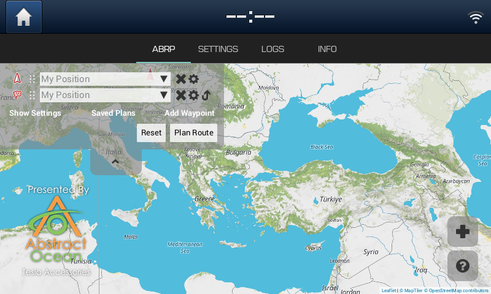

# ABRPTransmitter

Sends telemetry data from a Hyundai Ioniq EV to www.abetterrouteplanner.com. 
Features: 
* Sends SoC, speed, GPS location and external temperature to www.abetterrouteplanner.com without the need for a OBD dongle 
* Double press EV Button twice in two seconds to launch the app. 
* Double press Time twice in two seconds to launch "Engineering Menu". 

Getting started: 
Simply insert your token, check "Transmit data" and make sure your Ioniq has a connection to a WiFi hotspot. 

If you like my work I'd be happy if you buy me a coffee. Thanks! 

